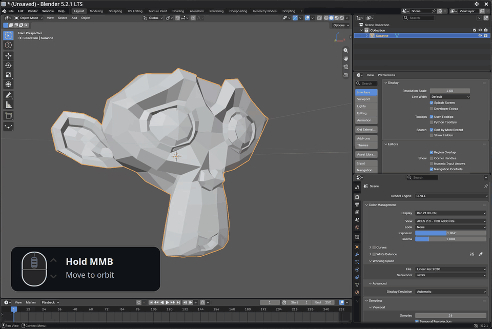

# Blender Addon - Simultaneous Zoom + Orbit
### Zoom and orbit in one fluid mouse gesture

Hold the middle mouse button down to orbit and scroll to zoom at the same time. Your mouse can still register scroll events even when the middle mouse button is held down. This addon takes advantage of that fact, and allows you you to orbit and zoom at the same time.

This addon also includes an optional align view to object with double right click.

Scroll zoom during continuous middle-mouse orbit. [video demo](docs/media/orbit-wheel-zoom.mp4).

## Use

Hold **Middle Mouse** and move to orbit. While still holding it, scroll to zoom.

**Double-right-click** an object, vertex, edge, face, or curve control point to
select it and center the view. 

## Install

1. Run `python3 scripts/package.py` to build `dist/orbit_wheel_zoom-1.1.0.zip`.
2. In Blender's Preferences -> Add-ons -> Install from Disk
3. Select the ZIP, then enable
